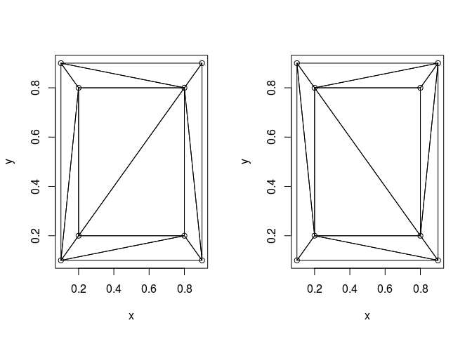
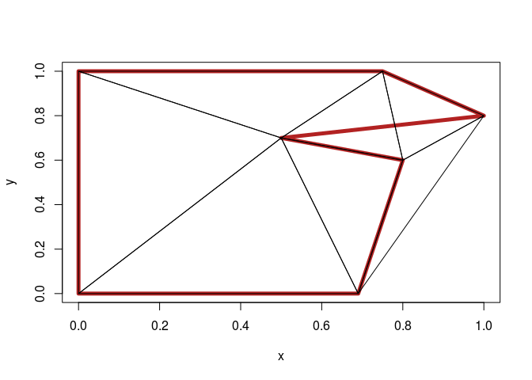

<!-- README.md is generated from README.Rmd. Please edit that file -->
cdt
===

The goal of cdt is to provide constrained Delaunay triangulation in R.

Example
-------

WIP, more soon

``` r
ct <- cdt:::load_cdt2d()
src1 <- "
//Then we define a list of points, represented as pairs of x,y coordinates
var points = [
  [-2,-2],
  [-2, 2],
  [ 2, 2],
  [ 2,-2],
  [ 1, 0],
  [ 0, 1],
  [-1, 0],
  [ 0,-1]
  ]
"
src2 <- "
//Next we can optionally define some edge constraints
// This set of edges determines a pair of loops
var edges = [
  //Outer loop
  [0, 1],
  [1, 2],
  [2, 3],
  [3, 0],
  
  //Inner loop
  [4, 5],
  [5, 6],
  [6, 7],
  [7, 4]
  ]
"

ct$eval(src1)
ct$eval(src2)
ct$eval("cdt2d(points, edges)")
#> [1] "0,6,1,0,7,6,0,3,7,1,6,5,1,5,2,2,4,3,2,5,4,3,4,7,4,5,7,5,6,7"


x <- c(.1, .1, .9, .9, .2, .2, .8, .8)
y <- c(.1, .9, .9, .1, .2, .8, .8, .2)
(gtri <- geometry::delaunayn(cbind(x, y)))
#> 
#>      PLEASE NOTE:  As of version 0.3-5, no degenerate (zero area) 
#>      regions are returned with the "Qt" option since the R 
#>      code removes them from the triangulation. 
#>      See help("delaunayn").
#>       [,1] [,2] [,3]
#>  [1,]    6    2    1
#>  [2,]    6    5    1
#>  [3,]    8    4    1
#>  [4,]    8    5    1
#>  [5,]    7    2    3
#>  [6,]    7    6    2
#>  [7,]    7    4    3
#>  [8,]    7    8    4
#>  [9,]    7    6    5
#> [10,]    7    8    5
(ctri <- cdt:::get_tri(x, y))
#>       [,1] [,2] [,3]
#>  [1,]    1    5    2
#>  [2,]    1    4    5
#>  [3,]    2    5    6
#>  [4,]    2    6    3
#>  [5,]    3    7    8
#>  [6,]    3    8    4
#>  [7,]    3    6    7
#>  [8,]    4    8    5
#>  [9,]    5    8    6
#> [10,]    6    8    7

op <- par(mfrow = c(1, 2))
plot(x, y)
apply(gtri, 1, function(a) lines(cbind(x, y)[c(a, a[1]), ]))
#> NULL
plot(x, y)
apply(ctri, 1, function(a) lines(cbind(x, y)[c(a, a[1]), ]))
```



    #> NULL
    par(op)


    ## no edge-grouping yet
    x <- c(0, 0, 0.75, 1, 0.5, 0.8, 0.69)
    y <- c(0, 1, 1, 0.8, 0.7, 0.6, 0)
    edges <- cbind(head(seq_along(x), -1), tail(seq_along(x), -1))
    etri <- cdt:::get_tri(x, y, edges)
    plot(x, y, type = "n")
    polygon(x, y, lwd = 5, border = "firebrick")
    apply(etri, 1, function(a) polygon(cbind(x, y)[a, ]))



    #> NULL


    #devtools::install_github("hypertidy/silicate")
    #devtools::install_github("hypertidy/silicore")

    ## we need a tojs handler to take the edges grouped by path
    ## 
    # library(silicate)
    # library(dplyr)
    # xx <- silicore:::SC0(minimal_mesh)
    # x <- xx$coord$x_; y <- xx$coord$y_; edges <-  as.matrix(xx$segment)
    # etri <- cdt:::get_tri(x, y, edges)
    # plot(xx$coord); apply(etri, 1, function(a) polygon(xx$coord[a, ]))

    # ## yikes, silicate needs some basics to sort out NA-sep
    # tasna <- rearcut::taslakes
    # tasna$g <- cumsum(c(0, abs(diff(is.na(rearcut::taslakes$x_)))))
    # tas <- na.omit(tasna)
    # coord0 <- tas[c("x_", "y_")]
    # 
    # library(dplyr)
    # gmap <- tibble::tibble(nrow = lengths(split(tas$g, tas$g))) %>% dplyr::mutate(path = row_number())
    # path_paste <- function(x, paster = function(...) paste(..., sep = "-")) {
    #   ## we are looking for  any of these three
    #   do.call(paster, x[intersect(names(x), c("object", "subobject", "path"))])
    # }
    # coord <- coord0 %>% dplyr::mutate(path = as.integer(factor(rep(path_paste(gmap), gmap$nrow))), 
    #                                   vertex = row_number()) %>%  dplyr::group_by(path) 
    # 
    # segs <- coord %>% select(path, vertex)  %>% 
    #   dplyr::mutate(.vx0 = vertex,   ## specify in segment terms 
    #                 .vx1 = vertex + 1L) %>% 
    #   dplyr::group_by(path)
    # segs <- dplyr::slice(segs, -n()) 
    # edges <- segs %>% dplyr::ungroup() %>% 
    #   dplyr::transmute(.vx0, .vx1)
    # 
    # etri <- cdt:::get_tri(tas$x_, tas$y_, edges = edges - 1)


    ## not right yet ...
    #plot(tas[c("x_", "y_")], pch = "."); apply(etri, 1, function(a) lines(tas[c(a, a[1]), ]))

    # 
    # library(magrittr)
    # tas <- rearcut::taslakes %>% na.omit()
    # gtri <- geometry::delaunayn(as.matrix(tas))
    # plot(tas, pch = "."); apply(gtri, 1, function(a) lines(tas[c(a, a[1]), ]))
    # ctri <- cdt:::get_tri(tas$x_, tas$y_)  ## pretty slow, we need poly2tri
    # ## why is this not the convex hull??
    # plot(tas, pch = "."); apply(ctri, 1, function(a) lines(tas[c(a, a[1]), ]))

Setup
-----

<https://github.com/mikolalysenko/cdt2d>

<https://cran.r-project.org/web/packages/V8/vignettes/npm.html>

Cadge details from here <https://github.com/hypertidy/rearcut>
